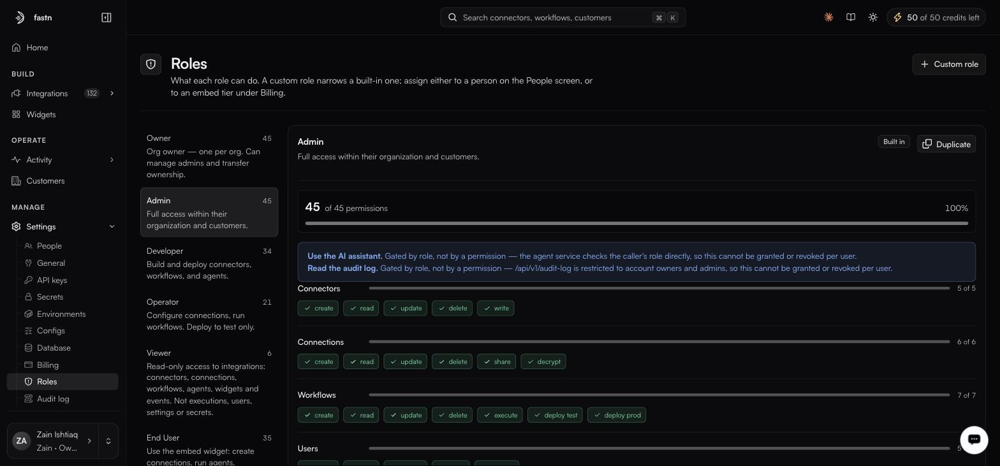

# Roles

**Settings → Roles**

<figure><figcaption></figcaption></figure>

> A custom role narrows a built-in one; assign either to a person on the People screen, or to an embed tier under Billing.

### The six built-in roles

| Role          | Permissions | Summary                                                                                                                 |
| ------------- | ----------- | ------------------------------------------------------------------------------------------------------------------------- |
| **Owner**     | 45          | One per organisation. Manages admins and transfers ownership.                                                            |
| **Admin**     | 45          | Full access within their organisation and customers.                                                                     |
| **Developer** | 34          | Builds and deploys connectors, workflows and agents.                                                                     |
| **Operator**  | 21          | Configures connections and runs workflows. Deploys to test only.                                                         |
| **Viewer**    | 6           | Read-only on connectors, connections, workflows, agents, widgets and events. Not executions, users, settings or secrets. |
| **End User**  | 35          | Uses the embed widget: creates connections, runs agents.                                                                 |

Selecting a role on the left shows its permission matrix, the count it holds out of 45, and a percentage bar. Built-in roles carry a **Built in** badge.

### Platform Admin

A seventh role, **Platform Admin**, appears in the organisation switcher rather than on this screen. It is platform-level — held by fastn, not something you assign to someone inside your own organisation — and it is what publishes connectors to the public catalogue.

### Roles here are not API-key permissions

The six roles on this screen govern **people**. API keys carry their own permission presets — `Full access`, `Developer`, `Operator`, `Viewer` (the default), `End user` and `Custom` — chosen on the key creation dialog. The names overlap, but they are two separate systems configured in two different places; granting a person the Developer role does nothing to a key, and vice versa. See [API keys](api-keys.md).

### The permission matrix

| Resource        | Permissions                                                        |
| --------------- | -------------------------------------------------------------------- |
| **Connectors**  | create, read, update, delete, write                                 |
| **Connections** | create, read, update, delete, share, decrypt                        |
| **Workflows**   | create, read, update, delete, execute, deploy test, deploy prod     |
| **Users**       | create, read, update, invite, remove                                |
| **Settings**    | read, update, manage                                                |
| **Events**      | create, read, update, delete, replay                                |
| **Secrets**     | read, write, delete                                                 |
| **Executions**  | create, read                                                        |
| **Widgets**     | create, read, update, delete                                        |
| **Unified API** | create, read, update, delete, execute                               |

### Two capabilities that are not permissions

Two things are gated by role directly rather than by a grantable permission, and cannot be turned on or off per user:

* **Use the AI assistant** — the agent service checks the caller's role.
* **Read the audit log** — `/api/v1/audit-log` is restricted to account owners and admins.

Both are called out in a banner at the top of any role that has them.

### Custom roles

**Custom role**, or **Duplicate** on a built-in, creates a role that *narrows* its parent. You can take permissions away; you cannot add ones the parent does not have.

Assign a custom role to a person on [People](people.md), or — as the line at the top of this screen puts it — to an embed tier under [Billing](billing.md), which is how you scope what an embedded end user may do.

### The boundary worth knowing

**Operator** is described on this screen as deploying **to test only**. Whether **Developer** holds `deploy prod` is the difference that usually draws the line between people who build and people who run — check the Developer matrix on this screen before you rely on it either way.

`decrypt` on Connections and `read` on Secrets are the two most sensitive permissions in the matrix. Viewer holds neither. Operator's matrix is worth reading directly rather than assumed.
