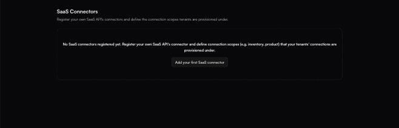

# SaaS Connectors

**Settings → SaaS Connectors**

> Register your own SaaS API's connectors and define the connection scopes tenants are provisioned under.

Every other connector in fastn represents someone else's system — Shopify, HubSpot, Jira. This screen is for the opposite case: **your own product's API**, registered so that your tenants' connections can be provisioned against it.

<figure><figcaption>Before anything is registered. The empty state repeats the whole concept, scopes included.</figcaption></figure>

With nothing registered the page reads:

> No SaaS connectors registered yet. Register your own SaaS API's connector and define connection scopes (e.g. inventory, product) that your tenants' connections are provisioned under.

### Registering one

**Add your first SaaS connector** (or **Add**, once the list is populated) opens the **Add SaaS Connector** panel, which takes two things.

| Field | Notes |
| ----- | ----- |
| **Connector \*** | A picker over the whole connector catalogue — *Select your SaaS API's connector…*. Its helper text is the important part: *"The connector for your own SaaS API — the one your tenants' connections are provisioned against."* This is not the system you are integrating **with**; it is the one representing **you**. |
| **Connection scopes** | A free-text field with an **Add** button beside it, seeded with the example `inventory`. Add as many as you need. |

The panel closes with **Cancel** and **Add SaaS Connector**.

### What a scope is for

The helper text under the scopes field states the rule directly:

> Each tenant holds at most one connection per scope (e.g. inventory, product). A widget tags its SaaS connector with a scope, and activation pins the tenant's matching connection.

Three consequences worth being deliberate about:

* **One connection per tenant per scope.** A scope is the uniqueness key. A tenant cannot hold two `inventory` connections to your API, so a scope is how you stop a customer from accidentally wiring the same thing twice.
* **Widgets tag against a scope.** The [widget](../embed/widget-builder/README.md) names the scope it wants, which is what lets one widget resolve to the right connection for whichever tenant is looking at it.
* **Activation pins the match.** When a tenant activates, the connection matching that scope is the one bound — so the scopes you choose here decide how granular per-tenant provisioning can be.

Pick scopes that name a *capability boundary* in your own API — `inventory`, `product`, `billing` — rather than one scope per customer. Customers are already the tenant axis; scopes are the second axis crossing it.


This screen sits in Settings alongside [Environments](environments.md) and [Configs](configs.md) rather than under Build, because registering your own API is an organisation-level act rather than something you do per integration.



How a scope behaves once connections exist against it — whether it can be renamed or removed with live tenant connections attached — is not documented here. Register a scope you intend to keep, and confirm the behaviour in your own workspace before restructuring one that is in use.

