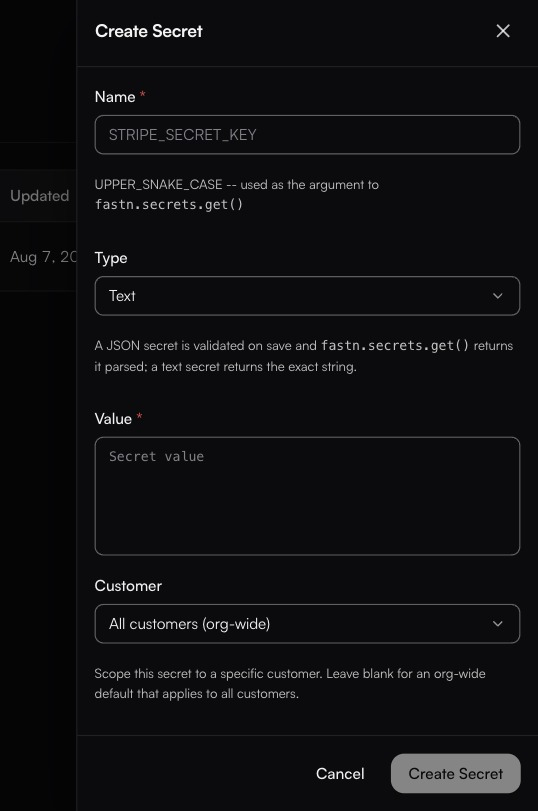

# Secrets

**Settings → Secrets**

> Encrypted values your workflows read at runtime. Scope a secret to a customer or environment for per-tenant overrides.

<figure><figcaption>The panel scrolls past what is shown here — an <strong>Environment</strong> selector follows <strong>Customer</strong>.</figcaption></figure>

A secret is written once and never shown again, so a key never has to live in your code:

```javascript
const apiToken = await fastn.secrets.get("SHOPIFY_API_TOKEN");
```

With no secrets yet, the page shows **No secrets yet** above the same instruction:

> A secret is written once and never shown again. Workflows read it with fastn.secrets.get.

### The list

Once secrets exist, the page is a table:

| Column | Holds |
| ------ | ----- |
| **Name** | The UPPER_SNAKE_CASE name, which is what your code passes to `fastn.secrets.get()`. |
| **Type** | `Text` or `JSON`. |
| **Scope** | Where the value applies — `org` for an org-wide default, otherwise the customer and/or environment it is pinned to. |
| **Created** / **Updated** | Dates. Overwriting a value moves **Updated**, since a secret is replaced rather than versioned. |

Each row ends in **Edit** and a delete control. The value itself is never shown in the table — only its metadata.

### Creating one

**New secret** opens the **Create Secret** side panel, which has five fields. The panel scrolls — **Environment** sits below **Customer**, past the fold.

| Field             | Notes                                                                                                         |
| ----------------- | --------------------------------------------------------------------------------------------------------------- |
| **Name \***       | UPPER\_SNAKE\_CASE. This string is literally the argument to `fastn.secrets.get()`, so `SHOPIFY_API_TOKEN` here is `fastn.secrets.get("SHOPIFY_API_TOKEN")` in code. |
| **Type**          | **Text** (the default) or **JSON**. The panel states the difference: *"A JSON secret is validated on save and `fastn.secrets.get()` returns it parsed; a text secret returns the exact string."* |
| **Value \***      | The value itself. Written once; the screen does not show it again afterwards.                                  |
| **Customer**      | Defaults to **All customers (org-wide)**; the dropdown lists your customers. *"Scope this secret to a specific customer. Leave blank for an org-wide default that applies to all customers."* |
| **Environment**   | Defaults to **All environments**; the other choices are **test** and **Live**. *"Scope this secret to a specific environment. Leave blank for an org-wide default."* |

To change a value, write a new one over the same name.

### Scoping

A secret can be org-wide, or scoped to a **customer**, an **environment**, or both — which is what gives you per-tenant overrides without branching in code. The same `fastn.secrets.get("PARTNER_TOKEN")` call is what runs for everybody.


How fastn picks between a customer-scoped and an environment-scoped value when both could match is not documented here. If you rely on overlapping scopes, set one up and confirm which value a run actually reads before you build on it.


### What belongs here

Third-party API tokens, database credentials, signing keys, webhook signing secrets — anything you would not paste into a ticket.

What does **not** belong here: connector credentials. Those live on [connections](../build/connections/README.md) and are managed by fastn, including OAuth refresh.


Deleting a secret takes effect immediately. Any workflow calling `fastn.secrets.get` for that name starts failing on its next run.


For non-sensitive per-environment values, use [Configs](configs.md) instead.
