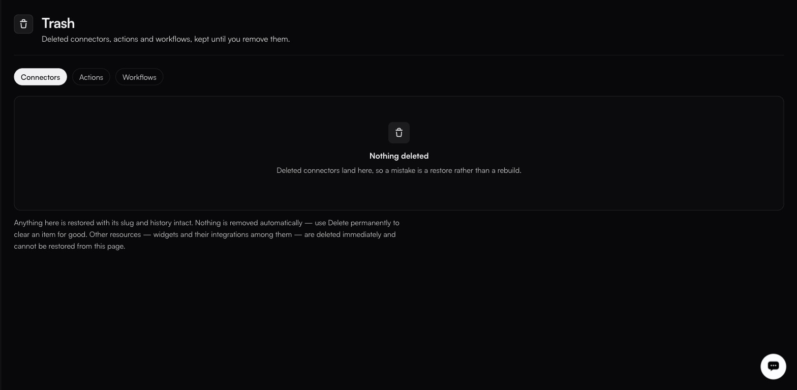

# Trash

**Settings → Trash**

<figure><figcaption></figcaption></figure>

> Deleted connectors, actions and workflows, kept until you remove them.

Three tabs: **Connectors** (the default), **Actions** and **Workflows**. The Workflows tab lists:

| Column                  | Notes                                        |
| ----------------------- | ---------------------------------------------- |
| **Name**                | The workflow's display name.                  |
| **Slug**                | Restored unchanged — see below.               |
| **Deleted**             | When it was moved here.                       |
| **In trash**            | How long it has been sitting here.            |
| **Restore**             | Puts it back.                                 |
| **Delete permanently**  | Removes it for good.                          |


**The Actions tab currently does not load.** It sits on *Loading deleted actions…* and never resolves. Deleted connector actions are still tracked — this is a defect in the tab, not evidence that nothing is there — but you cannot restore one from this screen while it persists.


### What restore gives you back

Anything here is restored with its slug and history intact. That matters — a workflow that referenced a connector by slug keeps working after a restore, which would not be true if you rebuilt it from scratch.

### Nothing expires

Nothing is removed automatically. Items stay until you use **Delete permanently** to clear one for good.


**Delete permanently** cannot be undone. There is no second trash.


### What does not come here

> Other resources — widgets and their integrations among them — are deleted immediately and cannot be restored from this page.

So the recoverable set is exactly connectors, connector actions and workflows. Anything else — a widget and the integrations configured on it, explicitly — goes when you delete it.

### In the audit log

Soft deletes, restores and permanent deletes are recorded separately from one another, which is what lets you reconstruct what happened to something after the fact. Filter by the resource on the [audit log](audit-log.md), and use its **All actions** dropdown for the exact action names your organisation emits.
