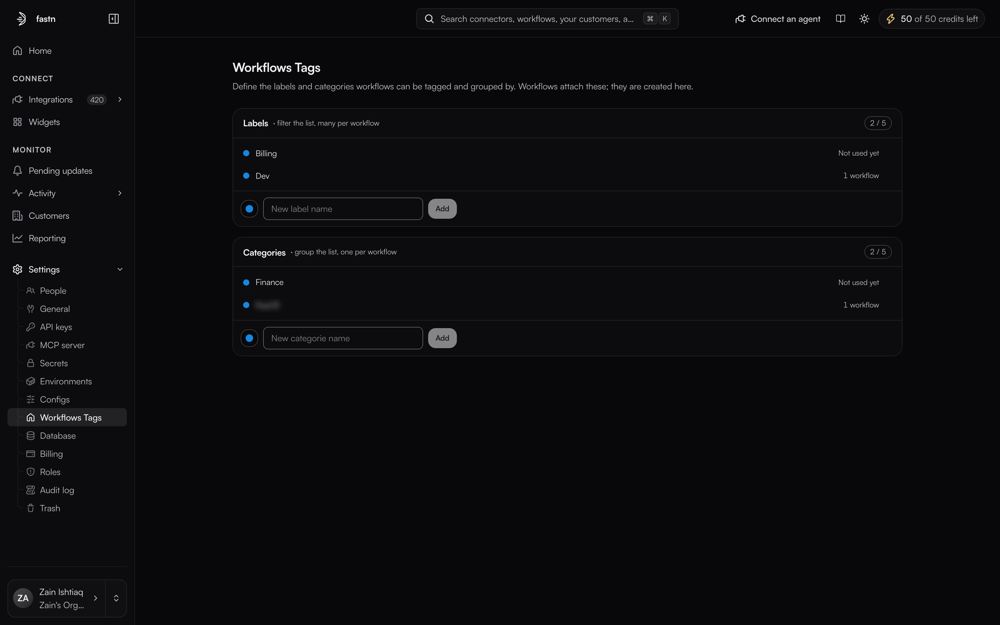
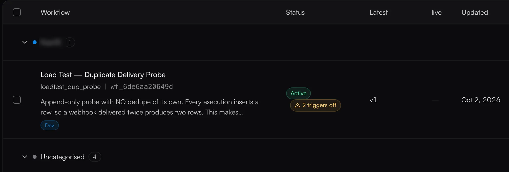

# Workflows Tags

**Settings → Workflows Tags**

Once a workspace holds more than a handful of workflows, the list stops being scannable. Tags are how you cut it back down. There are two kinds, and they behave differently on purpose.

| | Labels | Categories |
| --- | ------ | ---------- |
| Per workflow | Many | **One** |
| What they do to the list | Filter it | Group it |
| Per workspace | A number set by your plan | A number set by your plan |
| Per workflow limit | Up to 5 labels | n/a, a workflow is in one category or none |

A label is a tag you filter by, so a workflow can carry several: a sync can be both `Dev` and `Billing`. A category is where a workflow *lives*, so it only gets one, the way a file sits in one folder.

<figure><figcaption>Both panels carry a counter: how many you have defined, against the number your plan allows. Once they match, the name field is replaced until you delete something.</figcaption></figure>

## Creating one

Tags are created here and nowhere else. The page is the registry; workflows only attach what already exists.

1. Pick a colour from the swatch to the left of the field.
2. Type the name.
3. **Add**.

Each row then shows how many workflows use that tag, reading **Not used yet** until something does. That count is the thing to check before deleting one.


**The limit is per workspace, not per workflow.** The whole workspace shares one registry of labels and one of categories, and **how many of each you get comes from your plan**. [Billing and limits](billing.md) lists both, with your usage against them. The counter on each panel is the number that applies to you, so read it there rather than assuming one.

A customer workspace inherits the plan of the organisation it belongs to.


### When a panel is full

The name field is replaced by a line saying so, rather than being greyed out. Delete a tag to make room.

Changing plan never deletes a tag. If a new plan allows fewer than you already have, **you keep all of them** and simply cannot add another until you delete down to the new number. The panel says how many that is.

A full registry also affects workflows arriving from a prebuilt integration. Their tags are recreated by name in your workspace, so when there is no room left the workflow lands without that label, or uncategorised, and the result says which tag it could not create.

## Attaching one to a workflow

Tags are attached from the workflow itself, on **Workflows**, not from this page. Each workflow's panel carries two controls:

* **Labels**, a multi-select. A workflow can carry up to 5 of them, whatever your plan. That cap is separate from how many the workspace may define.
* **Category**, a single select. Choosing a new one replaces the old.

Both are available when you create a workflow and when you edit an existing one. Both are disabled for roles that cannot manage workflows, so a read-only role sees the tags but cannot change them.

## Using them on the list

<figure><figcaption>Labels render as chips on the row. Categories become the group headers.</figcaption></figure>

Two controls sit above the list:

* **Labels** filters it. Pick several and a workflow has to carry all of them to show, so the filter narrows rather than widens.
* **Group by category** switches the flat list into one group per category.

### Uncategorised

Every workflow without a category falls into **Uncategorised**. It is not a category you create or can delete, it is where everything starts, and a workspace that has never defined a category shows a single Uncategorised group holding everything.

## Deleting one

Deleting a tag never deletes the workflows carrying it.

* Delete a **label** and it comes off the workflows that had it.
* Delete a **category** and its workflows fall back to **Uncategorised**.


Deleting is the only way to make room once a panel is full. Check the usage count on the row first: a category showing **3 workflows** will drop those three into Uncategorised, and nothing records which category they used to be in.


## Who can change them

Tags follow workflow permissions rather than carrying their own:

| Action | Needs |
| ------ | ----- |
| See tags, filter and group by them | Permission to read workflows |
| Create a tag, attach one to a workflow | Permission to update workflows |
| Delete a tag | Permission to delete workflows |

Anyone who can edit a workflow can therefore also create a tag. See [Roles](roles.md).
