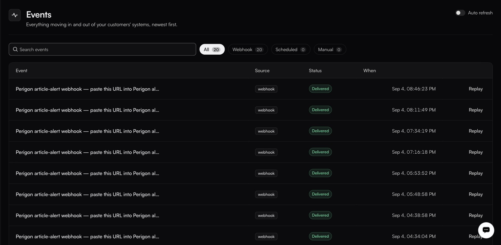

# Activity

Build tells you what should happen. Operate tells you what did.

<figure><figcaption>Events is where a debugging pass starts — did the thing arrive at all?</figcaption></figure>

**Activity** holds five logs, each answering a different question.

| Page                            | Route                     | Answers                                                          |
| ------------------------------- | ------------------------- | ------------------------------------------------------------------ |
| [Events](events.md)             | `/activity/events`        | What arrived, from where, and was it delivered?                   |
| [Traces](traces.md)             | `/activity/traces`        | Which connected systems did a run call?                           |
| [Alerts](alerts.md)             | `/activity/alerts`        | What should tell us something is wrong, and where does it go?     |
| [Executions](executions.md)     | `/activity/executions`    | Which runs happened, and how did each end?                        |
| [Sync reports](sync-reports.md) | `/activity/sync-reports`  | What actually changed, record by record?                          |

Also under Operate: **[Customers](customers.md)** — who is using your embedded integrations. It is a top-level item in the sidebar's OPERATE group, a sibling of Activity rather than one of its logs.

And [Troubleshooting](troubleshooting.md), which is a page of this documentation rather than a screen in the product: something is wrong, where do I look?

### How to debug in the right order

When a customer says "it stopped working", walk down rather than around:

1. **Events** — did the event arrive at all? If not, the problem is upstream or in the trigger.
2. **Executions** — did a run start, and how did it end? Failed, Timeout and Cancelled each point somewhere different.
3. **Traces** — which external call failed or hung?
4. **Sync reports** — if the run succeeded but the data is wrong, this shows what it actually wrote.
5. **Connections** — if calls are being rejected, open the connection itself. Search for the customer rather than using the status filter chips: they currently return nothing for every state, so an empty result there tells you nothing.


The step most teams skip is the first one: setting an [alert](alerts.md), so you reach step one before your customer does.


[Troubleshooting](troubleshooting.md) walks the same path organised by symptom.
