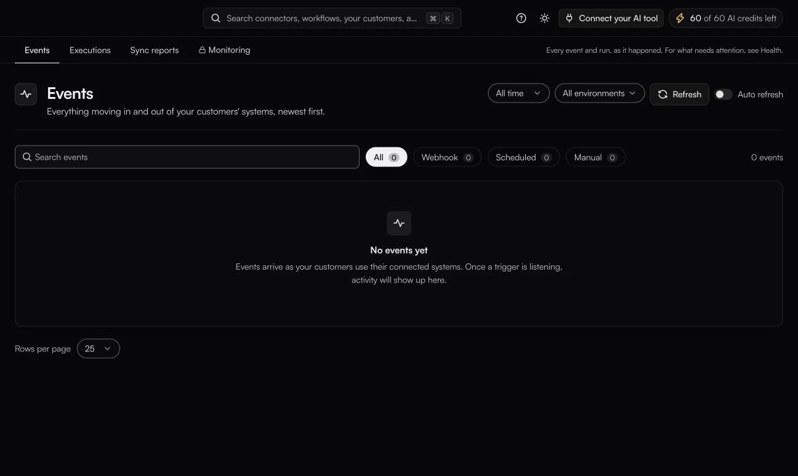

# Logs

Build tells you what should happen. Operate tells you what did.

<figure><figcaption>The Logs tab strip on the Launch plan.</figcaption></figure>

**Operate → Logs** (`/activity`) has three tabs, **Events**, **Executions** and **Sync reports**, each answering a different question. Owners and admins also see a fourth tab, **Monitoring**, shown locked on plans that do not include it. **Traces** is not on the tab strip: open it directly at `/activity/traces`.

| Page                            | Route                     | Answers                                                          |
| ------------------------------- | ------------------------- | ------------------------------------------------------------------ |
| [Events](events.md)             | `/activity/events`        | What arrived, from where, and was it delivered?                   |
| [Executions](executions.md)     | `/activity/executions`    | Which runs happened, and how did each end?                        |
| [Sync reports](sync-reports.md) | `/activity/sync-reports`  | What actually changed, record by record?                          |
| [Traces](traces.md) (by URL only) | `/activity/traces`      | Which calls did a run make to each app?                           |

[Alerts](alerts.md) live under **Health → Alerts** (`/health?tab=alerts`), and the old `/activity/alerts` address redirects there.

Also under Operate: **[Health](health.md)**, what needs attention across every customer; **[Customers](customers.md)**, who is using your embedded integrations; and **[Connections](../build/connections/README.md)**, every signed-in account.

And [Troubleshooting](troubleshooting.md), which is a page of this documentation rather than a screen in the product: something is wrong, where do I look?

### How to debug in the right order

When a customer says "it stopped working", walk down rather than around:

1. **Events**: did the event arrive at all? If not, the problem is upstream or in the trigger.
2. **Executions**: did a run start, and how did it end? Failed, Timed out and Canceled each point somewhere different.
3. **Traces** (by URL, `/activity/traces`): which external call failed or hung?
4. **Sync reports**: if the run succeeded but the data is wrong, this shows what it actually wrote.
5. **Connections**: if calls are being rejected, open the connection itself. Search for the customer or filter by status.


The step most teams skip is the first one: setting an [alert](alerts.md), so you reach step one before your customer does.


[Troubleshooting](troubleshooting.md) walks the same path organized by symptom.
