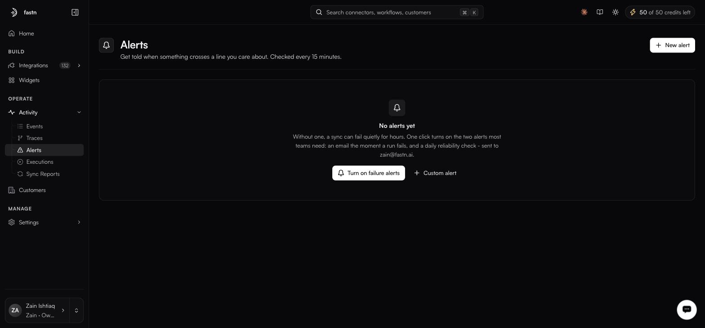
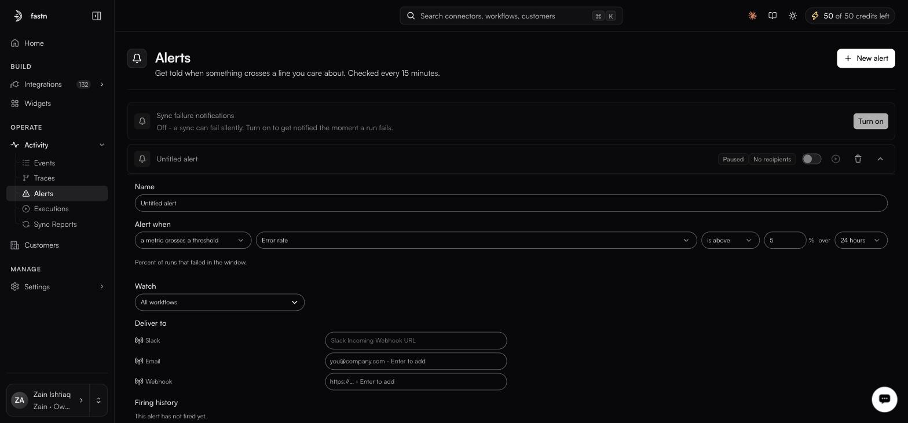

# Alerts

**Activity → Alerts**

<figure><figcaption></figcaption></figure>

Without an alert, a sync can fail quietly for hours. This is the cheapest insurance in the product.

### The one-click start

**Turn on failure alerts** sets up the two alerts most teams need: an email the moment a run fails, and a daily reliability check, both to the address on your account.

If you do nothing else on this page, do that.

### Custom alerts

<figure><figcaption></figcaption></figure>

**New alert** — or **Custom alert** on the empty state — opens the editor.

#### Alert when

Two shapes:

* **a run fails (instant)** — fires on the failure itself.
* **a metric crosses a threshold** — fires when a measured value goes above or below a number, over a window.

#### Metrics

| Metric                  | Measures                                        |
| ----------------------- | ------------------------------------------------- |
| **Error rate**          | Percent of runs that failed in the window.       |
| **Success rate**        | The inverse.                                     |
| **Failed runs**         | Count of failures.                               |
| **Total runs**          | Count of runs — catches a source that went quiet. |
| **Records synced**      | Volume moved.                                    |
| **Records failed**      | Records rejected downstream.                     |
| **Avg run time**        | Mean duration.                                   |
| **p95 run time**        | Tail latency.                                    |
| **Broken connectors**   | Connectors with failing connections.             |
| **Inactive workflows**  | Workflows that have stopped running.             |

Each takes **is above** or **is below**, a value, and a window of **1 hour**, **24 hours**, **7 days** or **30 days**.

#### Watch

Scope the alert to **All workflows** or to specific ones. Scope noisy metrics narrowly; a global error-rate alarm on a workspace with one flaky test workflow trains you to ignore it.

#### Deliver to

| Channel     | Configure                       |
| ----------- | --------------------------------- |
| **Slack**   | An incoming webhook URL.        |
| **Email**   | One or more addresses.          |
| **Webhook** | An HTTPS endpoint of your own.  |

An alert with no recipients shows **No recipients** and will not notify anyone.

#### Firing history

Each alert keeps a record of every time it fired — the fastest way to tell a real signal from a threshold set too tight.

### Evaluation

Threshold alerts are evaluated every 15 minutes. Run-failure alerts are instant.

### A starting set

| Alert                                                | Why                                              |
| ---------------------------------------------------- | -------------------------------------------------- |
| A run fails → email + Slack                          | The baseline.                                     |
| Error rate above 5% over 1 hour                      | Catches degradation before it is total.           |
| Total runs below 1 over 24 hours, on a daily sync    | Catches a schedule that silently stopped.         |
| Broken connectors above 0                            | Catches expired credentials before the customer does. |
