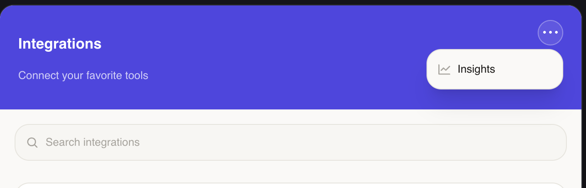
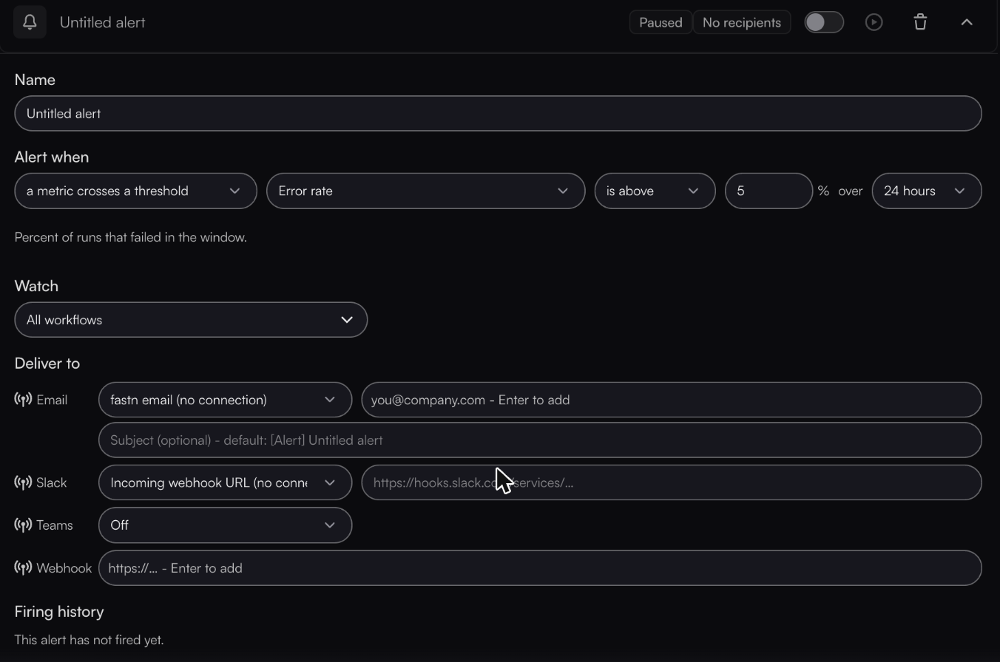

# Alerts

**Operate → Health → Alerts** · `/health?tab=alerts`

Without an alert, a sync can fail quietly for hours. This is the cheapest insurance in the product.

At the top of the tab, a **Notification channels** strip ("Email and webhooks work without a connection") shows which messaging apps are connected for alerts, with a way to connect the ones that are not. Below it, until an alert exists, sits the empty state:

> Without one, a sync can fail quietly for hours. One click turns on the two alerts most teams need…

under the heading **No alerts yet**, with **Turn on failure alerts** and **Custom alert** beside it. It names the address the two alerts would go to: the email you signed in with. If your session has no email, **Turn on failure alerts** is disabled; create a custom alert instead. **New alert** sits top-right.

### The one-click start

**Turn on failure alerts** creates the two alerts most teams need in one click: an email the moment a run fails, and a daily reliability check. If you do nothing else on this page, do that.

### Custom alerts

**New alert** (or **Custom alert** on the empty state), opens the editor.


**The editor autosaves, and there is no Save button.** **New alert** persists an alert on the server the moment you click it (an `Untitled alert`, **Paused**, with **No recipients**) and every subsequent edit is saved as you make it. There is nothing to confirm and nothing to cancel. If you opened one by accident, delete it from its row; closing the editor leaves it behind.


#### Alert when

Four types. **a metric crosses a threshold** is the default.

* **a run fails (instant)**: fires on the failure itself.
* **an event is not processed in time**: fires when an event arrived a set number of minutes ago (5 to 1440, default 15) and its workflow has not succeeded.
* **a metric crosses a threshold**: fires when a measured value goes above or below a number, over a window. The default.
* **workflow code raises it (fastn.alerts)**: fires only when your workflow code calls `fastn.alerts.send("<alert name>", { ... })`.

#### Metrics

**Error rate** is the default.

| Metric                  | Measures                                        | Unit    |
| ----------------------- | ------------------------------------------------- | ------- |
| **Error rate**          | Percent of runs that failed in the window.       | %       |
| **Success rate**        | The inverse.                                     | %       |
| **Failed runs**         | Count of failures.                               | count   |
| **Total runs**          | Count of runs: catches a source that went quiet. | count   |
| **Records synced**      | Volume moved.                                    | count   |
| **Records failed**      | Records rejected downstream.                     | count   |
| **Avg run time**        | Mean duration.                                   | ms      |
| **p95 run time**        | Tail latency.                                    | ms      |
| **Broken connectors**   | Connections that are not active right now.       | count   |
| **Inactive workflows**  | Workflows that have stopped running.             | count   |

Each takes **is above** or **is below**, a value, and a window of **1 hour**, **24 hours**, **7 days** or **30 days**.


Watch the unit when you type a threshold. The default alert is **Error rate is above 5**: five *percent*. Switching the metric resets the threshold to that metric's suggested value, in that metric's unit: **Failed runs** suggests 5 *runs*, and **Avg run time** and **p95 run time** are in milliseconds (suggested 5000 and 10000).


**Defaults on a new alert:** **a metric crosses a threshold**, metric **Error rate**, comparator **is above**, threshold **5%**, window **24 hours**.

#### Watch

A multi-select: leave it across everything, or pick the specific workflows this alert applies to. It appears for **a run fails** and **an event is not processed in time** alerts, and for threshold alerts on the run metrics (**Total runs**, **Failed runs**, **Error rate**, **Success rate**, **Avg run time**, **p95 run time**). Scope noisy metrics narrowly; a global error-rate alarm on a workspace with one flaky test workflow trains you to ignore it.

#### Deliver to

| Channel     | Configure                       |
| ----------- | --------------------------------- |
| **Email**   | One or more addresses, sent through fastn email or one of your Gmail connections, with an optional **Subject**. |
| **Slack**   | An incoming webhook URL, or a Slack connection and a channel. |
| **Teams**   | A connected Microsoft Teams account: pick the team, then the channel. |
| **Webhook** | An `http` or `https` endpoint of your own. |

Discord and Telegram deliveries can be [set up through the API](#set-deliveries-through-the-api).

An alert with no recipients shows **No recipients** and will not notify anyone.

#### Firing history

The editor shows the five most recent times the alert fired, each marked **Delivered** or with the delivery error: the fastest way to tell a real signal from a threshold set too tight. On a new one it reads `This alert has not fired yet.`

### Evaluation

Threshold alerts are evaluated every 15 minutes by default. Run-failure alerts fire within about a minute of the failure. Processing alerts fire once an event has waited longer than the minutes you set. Code alerts fire when your workflow code sends them.

### Set deliveries through the API

An alert rule's `deliveries` is an array of up to 10 channels. Send it to `POST /v1/alerts` or `PUT /v1/alerts/{id}` (see the [REST API reference](../reference/rest/observability.md)).

```json
{
  "name": "Sync failures",
  "mode": "instant",
  "deliveries": [
    { "type": "email", "to": "oncall@example.com", "subject": "Sync failed" },
    { "type": "webhook", "url": "https://example.com/hooks/fastn" },
    { "type": "slack", "url": "https://hooks.slack.com/services/..." },
    { "type": "connection", "connectionId": "conn_123", "target": "C0123456789", "targetName": "#alerts" }
  ]
}
```

| `type` | Fields | Notes |
| --- | --- | --- |
| `email` | `to` (required), `subject` | Sent through fastn email. `subject` is one line of at most 200 characters. |
| `webhook` | `url` (required) | An `http` or `https` URL. Receives the JSON below. |
| `slack` | `url` (required) | A Slack incoming webhook URL. Receives `{ "text": "..." }`. |
| `connection` | `connectionId` and `target` (required), `targetName`, `subject` | Sends through a connected account. `targetName` is a display name of at most 200 characters. `subject` applies to Gmail only. |

The `connectionId` must be one of your own connections. `GET /v1/alerts/channels` lists the ones you can use, and `GET /v1/events/alerts/channels/{connectionId}/targets` lists their targets where the app can. What `target` holds depends on the app:

| App | `target` |
| --- | --- |
| Slack | The channel |
| Gmail | The recipient's email address |
| Microsoft Teams | `channel:<teamId>:<channelId>` or `chat:<chatId>` |
| Discord | The channel id |
| Telegram | The chat id |

A `webhook` delivery receives this body:

```json
{
  "alert": {
    "id": "...",
    "name": "Sync failures",
    "metric": "failed_runs",
    "condition": "gt",
    "threshold": 0,
    "window": "24h"
  },
  "value": 1,
  "message": "...",
  "event": {
    "type": "workflow_failure",
    "workflowId": "wf_123",
    "workflowName": "Sync contacts",
    "executionId": "...",
    "status": "failed",
    "error": "...",
    "errorCategory": "...",
    "fixSuggestion": "...",
    "failures": 1
  }
}
```

`value` is the measured value and `message` is the text the other channels get. `event` depends on what fired, so switch on its `type` and ignore types you do not know:

| `event.type` | Sent for | Fields |
| --- | --- | --- |
| `workflow_failure` | **a run fails** alerts | As in the sample above. |
| `workflow_alert` | **workflow code raises it** alerts | `title`, `message`, `severity`, `key` and `data` from your `fastn.alerts.send` call, plus `count`, `summary`, `test`, `workflowId`, `workflowName`, `executionId`, `endOrgId`, `alertId`, and `alertIds` on a summary. |
| `platform_outage` | A fastn outage affecting your events | `startedAt`, `triggers`, `workflows`, `total`. |
| `platform_recovered` | The end of that outage | `startedAt` when known, `endedAt`. |

Threshold alerts have no `event`. On a code alert, `alert.metric` and `alert.window` do not describe the rule, so read `event` instead.

### A starting set

| Alert                                                | Why                                              |
| ---------------------------------------------------- | -------------------------------------------------- |
| A run fails → email + Slack                          | The baseline.                                     |
| Error rate above 5% over 1 hour                      | Catches degradation before it is total.           |
| Total runs below 1 over 24 hours, on a daily sync    | Catches a schedule that silently stopped.         |
| Broken connectors above 0                            | Catches expired credentials before the customer does. |

### Alerts your customers set up

Your customers can set up alerts themselves, from the widget inside your app. They do it from the **Insights** panel of the widget. Their alerts watch their own integrations and go to their own recipients, separately from the alerts on this page.

**Step 1: Open Insights**

1. Open the **Integrations** widget in the product where it's embedded.
2. Click the **...** (menu) button in the top right corner of the widget header.
3. Select **Insights**.

<figure><figcaption>The <strong>...</strong> menu in the widget header.</figcaption></figure>

**Step 2: Go to the alerts section**

Scroll to the bottom of the **Insights** panel. With no alerts yet, it shows **No alerts yet** with two buttons:

* **Turn on failure alerts**: turns on an email the moment a run fails and a daily reliability check. This is the quickest option. It is disabled if the session has no email.
* **Custom alert**: create a custom alert with your own conditions (Step 3).

Once an alert exists, the section shows a **Sync failure notifications** card, which notifies you the moment any sync run fails. If an instant alert for all workflows already exists (for example from **Turn on failure alerts**), switch the card's toggle on; otherwise click its **Turn on** button. The section also shows a **New alert** button.

**Step 3: Create a custom alert**

Click **Custom alert** (or **New alert** once an alert exists) and fill in:

* **Name**: for example, "Order sync failures".
* **Alert when**: the condition to alert on, for example error rate is above 5% over 24 hours.
* **Watch**: all workflows, or only a specific one (for example, HubSpot Deal to Order).
* **Deliver to**: where the alert is sent: Email, Slack, Microsoft Teams or a Webhook.

The fields are the same as in a [custom alert](#custom-alerts) above.

<figure><figcaption>A new custom alert, before it is turned on.</figcaption></figure>

**Step 4: Turn the alert on**

1. Switch the toggle next to the alert name on. A new alert starts paused.
2. Optionally, click the test (play) button to send a test alert and check it arrives.

**Firing history** under the alert shows every time it has fired.
