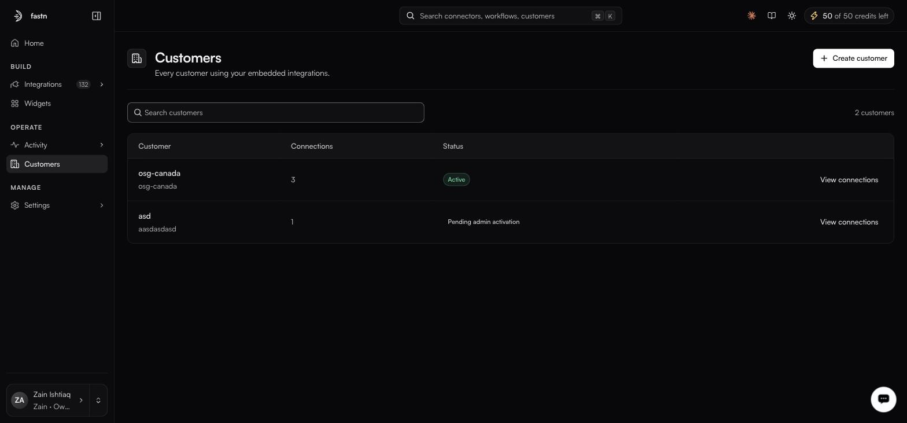

# Customers

**Customers** — a top-level item in the sidebar's OPERATE group, beside Activity rather than inside it.

<figure><figcaption></figcaption></figure>

A customer is one of your customers — a container for their connections, credentials and workflow data.

### The table

| Column          | Notes                                                          |
| --------------- | ---------------------------------------------------------------- |
| **Customer**    | Display name, with the identifier underneath.                   |
| **Connections** | How many systems they have authorised.                          |
| **Status**      | Active, or Pending admin activation.                            |

A count sits above the table, and **Search customers** narrows it. **View connections** on each row filters [Connections](../build/connections/README.md) to that customer.

### Status

**Active** — set up and usable.

**Pending admin activation** — created, but an administrator has not activated it. Its integrations will not run until they do.

### Creating a customer

**Create customer** adds one manually, which is what you want when onboarding an account before they first sign in.

The identifier is the stable one — use your own account ID rather than a display name. It is what you will see again as `endOrgId` in the [embed token](../embed/embedding/README.md) response, and as the final `tenant` segment of a connection ID.

### Customers and tenants

The product uses both words. **Tenant** is the column header on all three Triggers tables, and it is the last segment of the connection ID format:

```
ucl:org_<org>:<env>:<connectorId>:<authId>:<tenant>
```

Treat them as the same thing: one isolated customer container, called a tenant wherever the plumbing shows through.

### Where customers show up elsewhere

| Surface                            | What it does                                        |
| ---------------------------------- | ----------------------------------------------------- |
| ⌘K search, **CUSTOMERS** group     | Jump straight to one.                                |
| [Connections](../build/connections/README.md) | A **Customer** column on every connection.       |
| Widget builder preview             | The tenant selector renders the widget as a customer. |
| [Embed tab](../embed/embedding/README.md) | The **USER** selector scopes the generated snippet.  |
| Triggers tables                    | A **Tenant** column on webhooks, schedulers and app events. |
