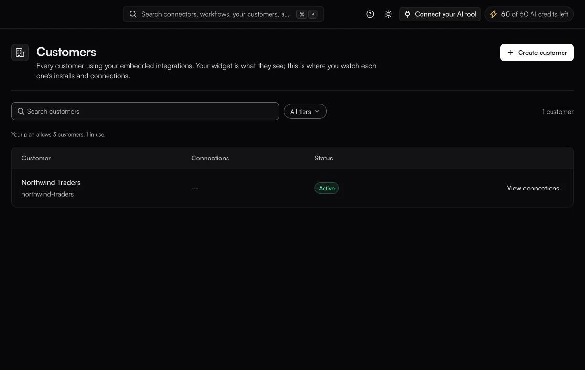
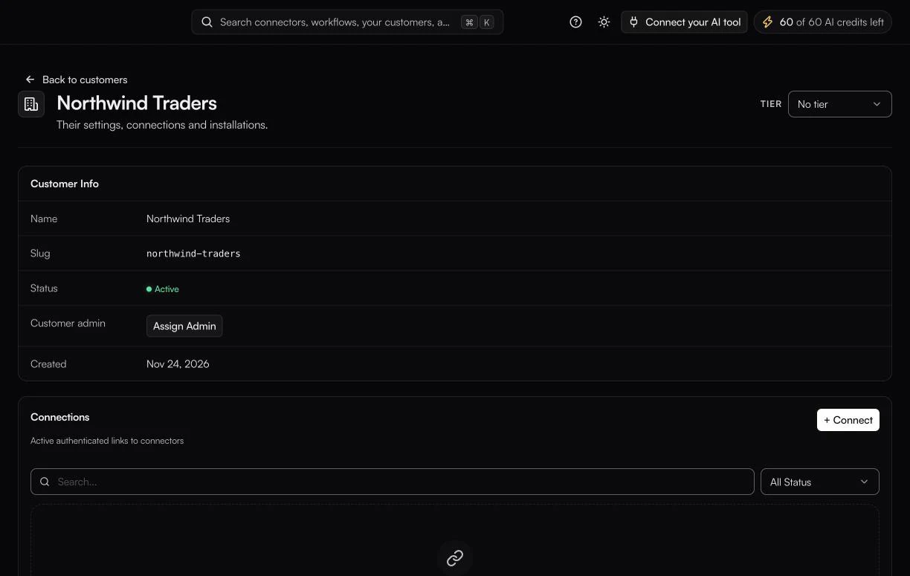
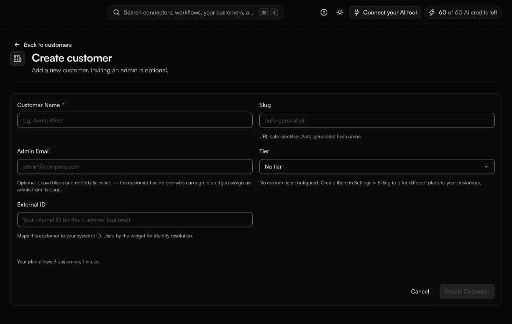

# Customers

**Operate → Customers** · `/customers`

A top-level item in the sidebar's **Operate** group, beside Health, Connections and Logs. It used to live under Settings at `/settings/customers`, and that old address redirects here.

<figure><figcaption>A test customer before it has connected any app.</figcaption></figure>

A customer is one company using your product: a container for their connections, credentials and workflow data.

### The table

| Column          | Notes                                                          |
| --------------- | ---------------------------------------------------------------- |
| **Customer**    | Display name, with the customer's slug underneath.              |
| **Connections** | How many apps they have authorized.                          |
| **Status**      | Active, Pending admin activation, Suspended, Pending review or Blocked. |

A count sits above the table, **Search customers** narrows it, and **All tiers** filters by customer tier. When your plan caps customers, a note above the table says so, for example *Your plan allows 3 customers, 1 in use.* At a hard cap, **Create customer** is refused until you remove a customer or move to a plan that allows more. **View connections** on each row opens that customer's panel on this page: their settings, connections and installations.

Click a customer to open its page: its details, its tier, its customer admin and its connections.

<figure><figcaption>A customer's own page: its details, then its connections.</figcaption></figure>

### Status

**Active**: set up and usable.

**Pending admin activation**: the customer admin you invited has not accepted the invitation yet.

**Suspended**: the customer has been suspended, and their users lose access.

**Pending review** and **Blocked**: the customer is held for review, or blocked.

### Create a customer

**Create customer** adds one manually, which is what you want when onboarding an account before they first sign in.

<figure><figcaption>Only the name is required. Leave <strong>Admin Email</strong> blank to invite nobody.</figcaption></figure>

You can put your own ID for the customer in **External ID** when you create it. When you mint an [embed token](../embed/embedding/README.md) or send `x-org-id`, identify the customer this way: use Fastn's customer id, or the External ID shown on the customer (your own id if you set one when creating the customer; otherwise it defaults to the slug). The token response names the customer by its External ID, as `orgId`.

### Customers in connection IDs

A connection's ID names the customer it belongs to:

```
ucl:<workspace>:<customer or default>:<connectorId>:<identity>[:<account>]
```

`default` in the customer segment means the connection belongs to your own organization rather than to a customer. Some API fields and older screens still say "tenant"; it means the same thing as customer.

### Where customers show up elsewhere

| Surface                            | What it does                                        |
| ---------------------------------- | ----------------------------------------------------- |
| ⌘K search, **Your customers** group | Picking one opens **Customers**.                    |
| [Connections](../build/connections/README.md) | A **Customer** column in the **Customers** view. |
| Widget builder preview             | The **View as** selector (default **View as admin**) renders the widget as a customer. |
| [Embed tab](../embed/embedding/README.md) | The **User** selector scopes the generated snippet.  |
