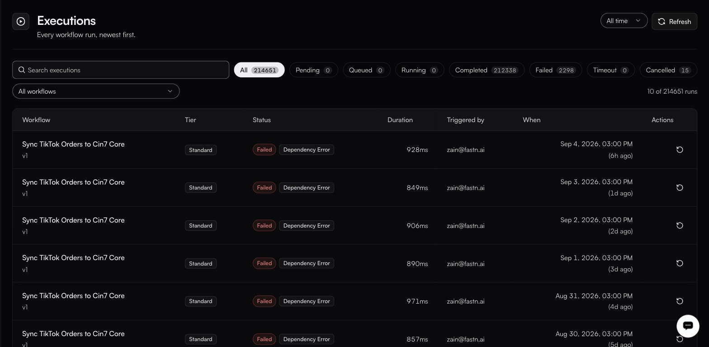

# Executions

**Activity → Executions**

<figure><figcaption></figcaption></figure>

The workspace-wide run history. Each workflow also has its own Executions tab in the editor.

### The table

| Column           | Notes                                                          |
| ---------------- | ---------------------------------------------------------------- |
| **Workflow**     | Name, with a version chip.                                      |
| **Tier**         | Instant, Standard or Long.                                      |
| **Status**       | See below.                                                      |
| **Duration**     | How long the run took.                                          |
| **Triggered by** | What started it.                                                |
| **When**         | Timestamp, in your timezone.                                    |
| **Actions**      | The **Replay** control re-runs the execution.                                          |

**Rows per page** is 10, 20 or 50.

### Filters

| Filter          | Values                                                                            |
| --------------- | ----------------------------------------------------------------------------------- |
| Date range      | **All time** (default), Last 15m, 1h, 6h, 24h, 7d, 30d                             |
| Status          | **All**, Pending, Queued, Running, Completed, Failed, Timeout, Cancelled           |
| Workflow        | One workflow, or all                                                               |

Alongside them: **Search executions** and **Refresh**.

| Status        | Meaning                                                           |
| ------------- | ------------------------------------------------------------------- |
| **Pending**   | Accepted, not yet queued.                                          |
| **Queued**    | Waiting for a runner.                                              |
| **Running**   | In progress.                                                       |
| **Completed** | Finished successfully.                                             |
| **Failed**    | Raised an error.                                                   |
| **Timeout**   | Exceeded its execution timeout.                                    |
| **Cancelled** | Stopped before finishing.                                          |

### Opening a run

This is where debugging actually happens. A row expands **inline** — you do not leave the page — into:

* A **result banner** for the run, and its **Raw response**.
* Chips summarising the run: **Steps**, **Success**, **Error**, **Slowest**.
* Tabs **Summary**, **Input** and **Output**.
* A footer carrying the two identifiers you need when asking anyone else about the run: `exec_…` and `wf_…`.

The Summary JSON carries the keys worth knowing by name:

| Key                                          | Tells you                                                  |
| -------------------------------------------- | ------------------------------------------------------------ |
| `totalSteps`, `succeeded`, `failed`          | How much of the run got through.                            |
| `slowestStep`, `slowestMs`                   | Where the time went — the first thing to read on a slow run. |
| `peakSandboxMB`, `sandboxMemoryLimitMB`      | How close the run came to its memory ceiling.               |


Read `peakSandboxMB` against `sandboxMemoryLimitMB` on any run that failed without an obvious error. Out-of-memory is one of the failures a retry policy never retries, so an OOM run will not quietly recover the way a transient failure does — it just stops.


### Reading the statuses

**Failed** is a workflow error — bad data, a rejected call, a bug. Expand the row for the result banner and raw response, then check [Traces](traces.md) for the external call behind it.

**Timeout** means the tier's budget ran out. Either the work genuinely needs longer, or a single external call is hanging. Check [Traces](traces.md) before raising the timeout.

**Queued** for an extended period means the run has been accepted but has not yet reached a runner.

**Cancelled** means the run stopped before finishing.

### The per-workflow tab

The **Executions** tab inside a workflow's editor filters differently: its pills are HTTP status codes — **All**, `200`, `201`, `400`, `404`, `422`, `500` — rather than run statuses. Use this page when you want to know *how a run ended*, and that tab when you want to know *what the caller got back*.
