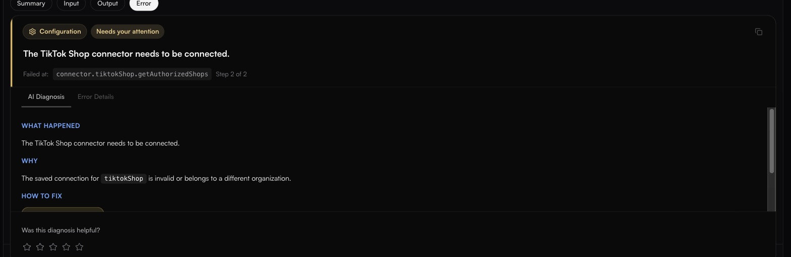

# Errors and failure states

Start with [Troubleshooting](../operate/troubleshooting.md) if you know the symptom but not the error. Use this page when you have an error in front of you and want to know what it means.


**This page lists the failure states verified in the product.** fastn does not publish a fixed catalogue of error codes — most failures surface as a category plus a message written for the specific case, rather than a numbered code. Where a literal string is quoted below, it is quoted verbatim from the product.


---

## Where the detail actually is

A failed run tells you almost nothing from the list. **Click the row.** It expands into a step summary and four tabs — **Summary**, **Input**, **Output** and **Error** — and the Error tab is where the answer is.

<figure><figcaption>The Error tab leads with a plain-language diagnosis; <strong>Error Details</strong> beside it holds the raw message.</figcaption></figure>

The Error tab carries, in order:

| Element | What it gives you |
| ------- | ----------------- |
| **Category chip** | What kind of problem it is — e.g. `Configuration` |
| **Severity chip** | How much of your attention it wants — e.g. `Needs your attention` |
| **Headline** | The problem in one sentence, in plain language |
| **Failed at** | The exact step that broke, as `connector.<slug>.<action>`, and its position — *Step 2 of 2* |
| **AI Diagnosis** tab | **WHAT HAPPENED**, **WHY**, and **HOW TO FIX** — the last usually with a deep link and numbered steps |
| **Error Details** tab | The raw underlying message, unedited |
| Footer | The execution and workflow ids, `exec_…` and `wf_…` — quote these in a support ticket |

**Read AI Diagnosis first and Error Details second.** The diagnosis names the fix; the raw message tells you whether the diagnosis matched what really happened.

There is a **Was this diagnosis helpful?** rating under it. It is worth answering — a wrong diagnosis on a common failure is a bug worth reporting.

---

## Dependency Error

The tag you will see most. It appears beside **Failed** in the Executions list.

**A dependency the workflow called did not do its job.** The workflow's own code ran; something it depended on — almost always a connector action — failed or refused. That is why the run is usually fast: it dies at the first call that will not work, not after a long timeout.

A real example, from a daily schedule that failed identically for nine consecutive days:

> **Failed at** `connector.tiktokShop.getAuthorizedShops` — Step 2 of 2
>
> **Diagnosis:** The TikTok Shop connector needs to be connected.
>
> **Why:** The saved connection for `tiktokShop` is invalid or belongs to a different organization.
>
> **Raw:** `tiktokShop.getAuthorizedShops failed: Pinned connection "…" is not usable or does not belong to this org for connector "tiktokShop"`

The usual causes, in rough order of frequency:

| Cause | How to confirm it | Fix |
| ----- | ----------------- | --- |
| The connection is **Expired** or **Failed** | [Connections](../build/connections/README.md), filtered to that customer | The customer re-authorises through your widget |
| The connection is **pinned and no longer usable**, or belongs to another org | The raw message names a pinned connection id | Re-authenticate, then select the active connection |
| The customer never connected that system | No row for them in Connections | They connect it |
| A scope is missing from the grant | The action fails where others on the same connector succeed | Reconnect with the scope the action needs |
| The upstream API changed | [Pending updates](../build/connector-updates.md) has a proposal for that connector | Accept the proposal |


**A Dependency Error will not fix itself, and it does not retry.** Retry policies cover transient failures; a connection that is invalid is not transient. A daily schedule in this state fails at the same minute every day until someone acts — which is exactly what failure alerts are for. See [Alerts](../operate/alerts.md).


---

## Execution statuses

Every run ends in one of these. They are the filter chips on [Executions](../operate/executions.md).

| Status | Means | Where to look next |
| ------ | ----- | ------------------ |
| **Pending** | Accepted, not yet queued | Nothing to do |
| **Queued** | Waiting for a runner | Nothing to do |
| **Running** | In progress | — |
| **Completed** | Finished successfully | [Sync reports](../operate/sync-reports.md), if the data looks wrong |
| **Failed** | Threw, or a dependency refused | The Error tab, as above |
| **Timeout** | The tier's budget ran out | [Traces](../operate/traces.md) — one slow call, or hundreds? |
| **Cancelled** | Stopped before finishing | — |

**Failed and Timeout are different problems.** Failed means something was wrong; Timeout means nothing was necessarily wrong except the clock. Do not raise the timeout on a Failed run — it will fail identically, just later.

### Out of memory

A run that hit the memory ceiling reports **Failed** with no obvious error. Expand it and read `peakSandboxMB` against `sandboxMemoryLimitMB` in the Summary tab — the default ceiling is 512 MB. **Out-of-memory never retries**, so it stops rather than recovering on the next attempt.

---

## API errors

Returned by the [HTTP API](api.md).

| Response | Means | Fix |
| -------- | ----- | --- |
| `WORKFLOW_NOT_PUBLISHED` | No snapshot has ever been published for that workflow, so there is no version to run | Publish a snapshot from the editor. **This is the single most common cause of "the API did nothing"** — every call returns it until you publish |
| `401` / `403` | The key is wrong, revoked, expired, outside its IP allowlist, or lacks the permission for what you called | Check the key on [API keys](../manage/api-keys.md). Key permissions are a preset plus a per-resource matrix on the key itself; [Roles](../manage/roles.md) govern people, not keys |
| A test key is rejected | `X-fastn-Test-Mode: true` was not sent. A test key is refused without it | Send the header, or use a live key |
| The wrong code ran | `x-fastn-env` decides. `test` runs the latest published version; any other slug runs the version deployed to that environment | Set the header deliberately |


A workflow that runs and throws is a **Failed execution, not a transport error**. The HTTP call may well return success. Look in [Executions](../operate/executions.md), not the response body.


---


### The error envelope

Every error the HTTP API returns carries the same shape:

```json
{
  "error": {
    "code": "CONN-REFRESH-FAILED",
    "message": "OAuth token refresh failed",
    "details": {},
    "retryAfter": 30
  }
}
```

`code` and `message` are always present. `details` appears only when there is structured context worth acting on. `retryAfter` appears on throttled responses, in **seconds** — the same value is sent as a standard `Retry-After` header, so a client that already honours that header needs no special handling.


Codes are stable; message wording is not. **Branch on `code`, never on `message`.**


### Error codes

The prefix tells you which service raised it: no prefix for the shared vocabulary, `CONN-` connector, `WF-` workflow, `AGT-` agent, `API-UNIFIED-` the [Unified API](../build/unified-apis/README.md), `EVT-` events.

**Shared — any endpoint can return these**

| Code | HTTP | Means |
| ---- | ---- | ----- |
| `AUTH_INVALID` | 401 | Invalid authentication credentials |
| `AUTH_EXPIRED` | 401 | Credentials have expired |
| `FORBIDDEN` | 403 | Permission denied |
| `NOT_FOUND` | 404 | Resource not found |
| `VALIDATION_ERROR` | 400 | Request validation failed — check `details` for the offending field |
| `CONFLICT` | 409 | Resource conflict |
| `RATE_LIMITED` | 429 | Rate limit exceeded — honour `retryAfter` |
| `QUOTA_EXCEEDED` | 429 | Plan quota exceeded. Unlike `RATE_LIMITED`, waiting will not clear it |
| `PAYMENT_REQUIRED` | 402 | Quota exhausted and billing action is needed. See [Billing and limits](../manage/billing.md) |
| `METHOD_NOT_ALLOWED` | 405 | Wrong HTTP method for that route |
| `PAYLOAD_TOO_LARGE` | 413 | Request body over the size limit |
| `INTERNAL_ERROR` | 500 | Unhandled server error — safe to retry once, then report |
| `SERVICE_UNAVAILABLE` | 503 | Service temporarily unavailable — retry with backoff |
| `UPSTREAM_ERROR` | 502 | A service fastn depends on failed |
| `DB_ERROR` | 500 | Database operation failed |
| `TIMEOUT` | 504 | Operation timed out |

**Connector** — see [Connection statuses](#connection-statuses) for the fix in each case.

| Code | HTTP | Means |
| ---- | ---- | ----- |
| `CONN-AUTH-FAILED` | 401 | The connection's credential was rejected by the provider |
| `CONN-REFRESH-FAILED` | 401 | An OAuth token could not be refreshed. Reconnect — this will not recover on its own |
| `CONN-EXEC-FAILED` | 502 | The connector ran but the provider call failed |

**Workflow**

| Code | HTTP | Means |
| ---- | ---- | ----- |
| `WF-EXEC-FAILED` | 500 | The run threw. The detail is in [Executions](../operate/executions.md), not this response |
| `WF-TIMEOUT` | 504 | The run exceeded its tier's time budget |

**Agent**

| Code | HTTP | Means |
| ---- | ---- | ----- |
| `AGT-LLM-ERROR` | 502 | The model provider returned an error |
| `AGT-TIMEOUT` | 504 | The agent request timed out |

**Unified API**

| Code | HTTP | Means |
| ---- | ---- | ----- |
| `API-UNIFIED-ENTITY-UNSUPPORTED` | 404 | No such unified entity |
| `API-UNIFIED-OPERATION-UNSUPPORTED` | 404 | That entity does not support the operation |
| `API-UNIFIED-NO-PROVIDER` | 404 | Nothing is connected that can serve the entity |
| `API-UNIFIED-MULTIPLE-PROVIDERS` | 409 | More than one provider is connected — name the one you want |
| `API-UNIFIED-CURSOR-INVALID` | 400 | The pagination cursor is malformed or expired |
| `API-UNIFIED-VALIDATION-FAILED` | 400 | The record failed the unified schema |
| `API-UNIFIED-PROVIDER-AUTH-FAILED` | 401 | The underlying provider rejected the credential |
| `API-UNIFIED-PROVIDER-RATE-LIMITED` | 429 | The provider throttled the call, not fastn |
| `API-UNIFIED-PROVIDER-ERROR` | 502 | The provider request failed |

**Events** — these two reach a caller; the remaining event codes are operational and surface in [Trigger failure states](#trigger-failure-states) rather than an API response.

| Code | HTTP | Means |
| ---- | ---- | ----- |
| `EVT-WEBHOOK-AUTH-FAILED` | 401 | An inbound webhook failed its signature or secret check |
| `EVT-WEBHOOK-DELIVERY-FAILED` | 502 | An outbound delivery failed |

### Older code names

Prefixed codes are canonical, but the earlier flat names are still returned by some paths and mean exactly the same thing. Treat each pair as one code:

| Canonical | Also seen as |
| --------- | ------------ |
| `CONN-AUTH-FAILED` / `CONN-REFRESH-FAILED` / `CONN-EXEC-FAILED` | `CONNECTOR_AUTH_FAILED` / `CONNECTOR_REFRESH_FAILED` / `CONNECTOR_EXEC_FAILED` |
| `WF-EXEC-FAILED` / `WF-TIMEOUT` | `WORKFLOW_EXEC_FAILED` / `WORKFLOW_TIMEOUT` |
| `AGT-LLM-ERROR` / `AGT-TIMEOUT` | `AGENT_LLM_ERROR` / `AGENT_TIMEOUT` |
| `API-UNIFIED-*` | `UNIFIED_*` — e.g. `API-UNIFIED-NO-PROVIDER` is `UNIFIED_NO_CONNECTED_PROVIDER` |
| `EVT-*` | `WEBHOOK_AUTH_FAILED`, `WEBHOOK_DELIVERY_FAILED` |

### When no code was set

Some routes return a bare status with no explicit code. One is then derived from the status, so you still get a usable `code`:

`400` and `422` → `VALIDATION_ERROR` · `401` → `AUTH_INVALID` · `402` → `PAYMENT_REQUIRED` · `403` → `FORBIDDEN` · `404` → `NOT_FOUND` · `405` → `METHOD_NOT_ALLOWED` · `408` and `504` → `TIMEOUT` · `409` → `CONFLICT` · `429` → `RATE_LIMITED` · `500` → `INTERNAL_ERROR` · `502` → `UPSTREAM_ERROR` · `503` → `SERVICE_UNAVAILABLE`

Any status outside that list yields `HTTP_<status>`.
## Trigger failure states

### App events — `Subscription: Failed`

On the [App events](../build/triggers/app-events.md) list, `Subscription` is a separate column from `Status`, and it is the one that matters. **A trigger can read `Active` and still never fire**, because *Status* is whether you enabled it and *Subscription* is whether fastn managed to register for events with the provider.

Recover with **Retry Subscription** from the row menu. If it fails again the problem is upstream — check the connection is live and still carries the scopes the event needs.

### Schedules — auto-disabled

fastn disables a schedule trigger that keeps failing. The `Failures` column counts *consecutive* failures and resets on a success; a climbing number is the warning. Once disabled, a re-enable cooldown applies, and the reason is recorded in **Status history** on the trigger's detail panel.

So a nightly job that stopped may have been switched off by the platform rather than by a colleague. See [Triggers](../build/triggers/README.md#when-fastn-disables-a-trigger-for-you).

### Webhooks — delivery exhausted

When the delivery attempts run out, the event is recorded as failed and can be replayed from [Events](../operate/events.md). Note that Events filters by *source*, not status, so on a busy org you will need to search by the trigger's name rather than filter for failures.


**Replay re-runs the workflow for real.** Without a deduplication key on the trigger and an idempotency guard in the workflow, replaying writes the record twice. See [Troubleshooting](../operate/troubleshooting.md#duplicates-after-a-replay).


---

## Connection statuses

From [Connections](../build/connections/README.md). A connection that is not healthy is the root cause of most Dependency Errors.

| Status | Means | Fix |
| ------ | ----- | --- |
| **Active** | Working | — |
| **Expired** | The credential ran out and could not be refreshed | The customer re-authorises through your widget |
| **Failed** | Access was revoked, a password changed, or a key was rotated | Same — the customer reconnects |
| **Inactive** | Not currently in use | The row menu offers **Reconnect** and **Disconnect**; there is no re-enable |

---

## Embed and widget

| What you see | Means |
| ------------ | ----- |
| `fastn:session-expired` posted to the parent window | The embed session hit the **seven-day refresh cap**. Refreshing again will not extend it — listen for this message and mint a fresh token |
| The widget renders blank | Usually an expired or hard-coded token. Fetch a fresh one on each load |

---

## What is not covered here

Being straight about the boundary: this page documents the failure states reachable through the product's own screens. It is **not** a generated list of every error string the platform can emit — fastn does not publish one, and inventing codes would be worse than omitting them.

If you hit an error that is not here:

1. Open the execution's **Error Details** tab for the raw message.
2. Quote the `exec_…` and `wf_…` ids to support — they identify the run exactly.
3. Rate the AI diagnosis, if there was one. A wrong diagnosis on a common failure is worth reporting.
