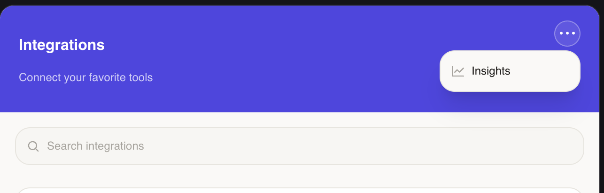
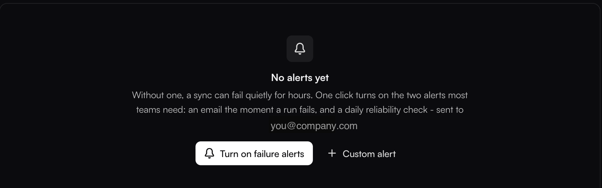
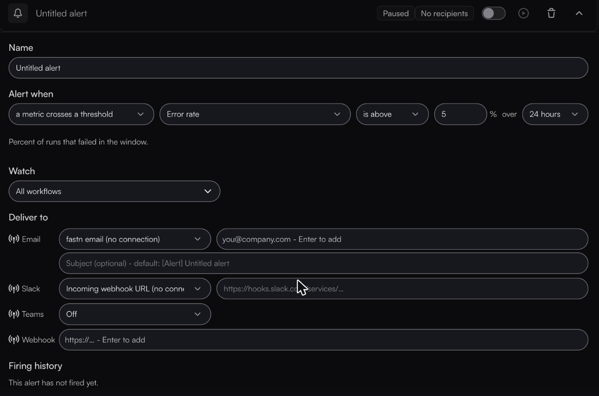

# Getting Alerted

A sync that stops is worse than a sync that fails loudly: nothing errors, nothing lands in your inbox, and the first signal is a colleague asking why a record never arrived. Alerts close that gap, and you can set them up yourself from inside the widget — no fastn account, no request to your provider.

### Where they live

In the widget header, open the **⋯** menu and choose **Insights**.

<figure><figcaption>The <strong>⋯</strong> menu in the widget header. Insights is the way in.</figcaption></figure>

The panel that opens leads with your integration metrics — what is running, what needs attention, recent runs — and the alerts section sits at the bottom, below the workflow list.


**No ⋯ menu, or no Insights in it?** Insights lives in that menu and is on by default, but an older widget configuration can leave it hidden. If it is not there, contact your SaaS provider — this is where alerts for your organization are set up.


### The one-click start

With nothing set up yet, the section offers the two alerts most teams want:

<figure><figcaption><strong>Turn on failure alerts</strong> creates both in one click. The address shown is the one they will be sent to.</figcaption></figure>

**Turn on failure alerts** creates an email the moment a run fails, plus a daily reliability check. If you do nothing else on this page, do that. **Custom alert** opens an empty card instead.

Once alerts exist, the one-click option stays available as a **Sync failure notifications** row — _Off - a sync can fail silently. Turn on to get notified the moment a run fails._ — with **+ New alert** beside it for everything else.

### Building a custom alert

A new alert is a card you edit in place. Every field is on it:

<figure><figcaption>Defaults on a new alert: Error rate, is above, 5%, over 24 hours, watching all workflows.</figcaption></figure>

1. **Name it** for what it means to you — _Orders stopped arriving_ beats _Untitled alert_.
2. **Alert when** — either **a run fails (instant)**, which fires on the failure itself, or **a metric crosses a threshold**, the default.
3. **Pick the metric**, the comparison (**is above** / **is below**), a value, and the window: 1 hour, 24 hours, 7 days or 30 days.
4. **Watch** — leave it on **All workflows**, or pick the specific ones this alert applies to.
5. **Deliver to** — at least one channel. An alert with no recipients shows **No recipients** and notifies nobody.
6. **Enable it.** A new alert is created **paused**. Flip the toggle on the card; its tooltip reads _Paused - click to enable_.


**A new alert is paused, and the card saves as you type.** Those two together are the trap: edits persist the moment you make them, with no Save button to confirm and nothing to cancel — but filling in every field still leaves the rule **paused** until you flip the toggle. A card you completed and walked away from is not watching anything.


### What you can watch

| Metric | Measures | Unit |
| --- | --- | --- |
| **Error rate** | Percent of runs that failed in the window. | % |
| **Success rate** | Percent that succeeded — alert when it drops. | % |
| **Failed runs** | Number of runs that failed. | count |
| **Total runs** | Number of runs — alert when activity drops off. | count |
| **Records synced** | Records successfully synced — alert when a sync stalls. | count |
| **Records failed** | Records that failed to sync. | count |
| **Avg run time** | Average run duration. | ms |
| **p95 run time** | Slowest runs — catches tail latency. | ms |
| **Broken connectors** | Connections that are not active right now. | count |
| **Inactive workflows** | Enabled integrations that have not run in the window. | count |


Watch the unit when you type a threshold. **Error rate is above 5** means five _percent_. Switch to **Failed runs** and the same 5 means five _runs_ — a far tighter trigger than it looks. The run-time metrics are in milliseconds, so a five-second threshold is `5000`.


### Where it gets delivered

Four channels, each a row with its own **Send via** choice:

| Channel | Send via | What you provide |
| --- | --- | --- |
| **Email** | fastn's own mail, or one of your connected Gmail accounts | One or more addresses, and an optional subject (default `[Alert] <alert name>`) |
| **Slack** | An Incoming Webhook URL, or a connected Slack account | The webhook URL, or a channel picked from your workspace |
| **Teams** | A connected Teams account | The team, then the channel |
| **Webhook** | — | An endpoint of your own, to route into whatever you already use |

The connection options only list apps **you** have connected and that are currently active. Routing through a connected Slack or Teams account means no webhook URL to generate and no secret to store.

Each card also has a **Send test** button that posts a sample through whatever you have configured. It is disabled until you add a channel — the tooltip says _Add a channel first_ — and it is the fastest way to confirm delivery works, rather than waiting for a real failure to find out.

### A starting set

Three alerts cover most of what actually goes wrong:

| Alert | Catches |
| --- | --- |
| **A run fails (instant)** | Something is erroring right now. This is what **Turn on failure alerts** gives you. |
| **Total runs** below 1 over 24 hours | A sync stopped running entirely — the failure that is otherwise silent. |
| **Broken connectors** above 0 | An app's authorization expired, before anyone notices missing data. |

The second one is the one people skip and later wish they had.

### How soon you hear

**A run fails (instant)** fires off the failure itself, within about a minute. **Threshold** alerts are evaluated every **15 minutes**, so expect notice within that window rather than immediately. Each rule also has a cooldown, so a sustained problem does not become a flood of identical messages.

Every alert keeps its own **Firing history** on the card — on a new one it reads _This alert has not fired yet._ It is the fastest way to tell a real signal from a threshold set too tight: if one has been firing every hour since yesterday, the threshold is wrong, not your integration.

### Who sees what

**Alerts are not shared.** Each organization has its own:

* Alerts you create here watch **your** integrations and notify **your** recipients. Your SaaS provider does not receive them.
* Alerts your provider has set up on their own account do **not** cover you specifically. Them being alerted is not you being alerted.

So if an integration failing matters to you, set up your own rule — do not assume someone upstream is watching on your behalf.

### What you can do next

* [Viewing Sync Status & History](viewing-sync-status-and-history.md) — what to look at once an alert fires
* [Extending a Pre-Built Integration](extending-a-prebuilt-integration.md) — fixing the configuration that caused it
